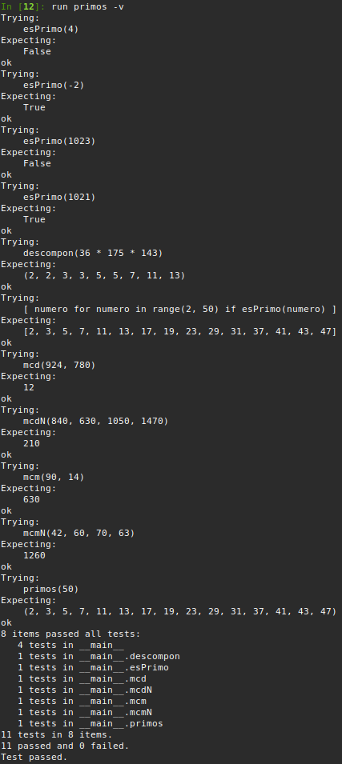

# Segunda tarea de APA 2023: Manejo de números primos

## Tomàs Lloret Martínez

## Fichero `primos.py`

- El alumno debe escribir el fichero `primos.py` que incorporará distintas funciones relacionadas con el manejo
  de los números primos.

- El fichero debe incluir una cadena de documentación que incluirá el nombre del alumno y los tests unitarios
  de las funciones incluidas.

- Cada función deberá incluir su propia cadena de documentación que indicará el cometido de la función, los
  argumentos de la misma y la salida proporcionada.

- Se valorará lo pythónico de la solución; en concreto, su claridad y sencillez, y el uso de los estándares marcados
  por PEP-8. También se valorará su eficiencia computacional.

### Determinación de la *primalidad* y descomposición de un número en factores primos

Incluya en el fichero `primos.py` las tres funciones siguientes:

- `esPrimo(numero)`   Devuelve `True` si su argumento es primo, y `False` si no lo es.
- `primos(numero)`    Devuelve una **tupla** con todos los números primos menores que su argumento.
- `descompon(numero)` Devuelve una **tupla** con la descomposición en factores primos de su argumento.

### Obtención del mínimo común múltiplo y el máximo común divisor

Usando las tres funciones del apartado anterior (y cualquier otra que considere conveniente añadir), escriba otras
dos que calculen el máximo común divisor y el mínimo común múltiplo de sus argumentos:

- `mcm(numero1, numero2)`:  Devuelve el mínimo común múltiplo de sus argumentos.
- `mcd(numero1, numero2)`:  Devuelve el máximo común divisor de sus argumentos.

Estas dos funciones deben cumplir las condiciones siguientes:

- Aunque se trate de una solución sub-óptima, en ambos casos deberá partirse de la descomposición en factores
  primos de los argumentos usando las funciones del apartado anterior.

- Aunque también sea sub-óptimo desde el punto de vista de la programación, ninguna de las dos funciones puede
  depender de la otra; cada una debe programarse por separado.

### Obtención del mínimo común múltiplo y el máximo común divisor para un número arbitrario de argumentos

Escriba las funciones `mcmN()` y `mcdN()`, que calculan el mínimo común múltiplo y el máximo común divisor para un
número arbitrario de argumentos:

- `mcm(*numeros)`:  Devuelve el mínimo común múltiplo de sus argumentos.
- `mcd(*numeros)`:  Devuelve el máximo común divisor de sus argumentos.

### Tests unitarios

La cadena de documentación del fichero debe incluir los tests unitarios de las cinco funciones. En concreto, deberán
comprobarse las siguientes condiciones:

- `esPrimo(numero)`:  Al ejecutar `[ numero for numero in range(2, 50) if esPrimo(numero) ]`, la salida debe ser
                      `[2, 3, 5, 7, 11, 13, 17, 19, 23, 29, 31, 37, 41, 43, 47]`.
- `primos(numeor)`: Al ejecutar `primos(50)`, la salida debe ser `(2, 3, 5, 7, 11, 13, 17, 19, 23, 29, 31, 37, 41, 43, 47)`.
- `descompon(numero)`: Al ejecutar `descompon(36 * 175 * 143)`, la salida debe ser `(2, 2, 3, 3, 5, 5, 7, 11, 13)`.
- `mcm(num1, num2)`: Al ejecutar `mcm(90, 14)`, la salida debe ser `630`.
- `mcd(num1, num2)`: Al ejecutar `mcd(924, 780)`, la salida debe ser `12`.
- `mcmN(numeros)`: Al ejecutar `mcm(42, 60, 70, 63)`, la salida debe ser `1260`.
- `mcdN(numeros)`: Al ejecutar `mcd(840, 630, 1050, 1470)`, la salida debe ser `210`.

### Entrega

#### Ejecución de los tests unitarios

Inserte a continuación una captura de pantalla que muestre el resultado de ejecutar el fichero `primos.py` con la opción
*verbosa*, de manera que se muestre el resultado de la ejecución de los tests unitarios.



#### Código desarrollado

Inserte a continuación el contenido del fichero `primos.py` usando los comandos necesarios para que se realice el
realce sintáctico en Python del mismo.

```python
'''
Autor: Tomàs Lloret Martínez
Fecha: 13/03/2025
APA - Práctica 2: Manejo de números primos

Módulo que define funciones con números primos.

>>> esPrimo(4)
False

>>> esPrimo(-2)
True

>>> esPrimo(1023)
False

>>> esPrimo(1021)
True
'''

'''
Determinación de la primalidad y decomposición de un número en factores primos
'''

def esPrimo(numero):
    '''
    Devuelve true si es primo y false si no lo es

    >>> [ numero for numero in range(2, 50) if esPrimo(numero) ]
    [2, 3, 5, 7, 11, 13, 17, 19, 23, 29, 31, 37, 41, 43, 47]
    '''
    for test in range(2, numero):
        if numero % test == 0:
            return False
    return True

def primos(numero):
    '''
    Devuelve tupla con los primos menores a numero

    >>> primos(50)
    (2, 3, 5, 7, 11, 13, 17, 19, 23, 29, 31, 37, 41, 43, 47)
    '''
    primos = []
    for n in range(2, numero):
        if esPrimo(n):
            primos.append(n)
    return tuple(primos)

def descompon(numero):
    '''
    Deveuelve tupla con la decomposición en primos de numero

    >>> descompon(36 * 175 * 143)
    (2, 2, 3, 3, 5, 5, 7, 11, 13)
    '''
    factores = []
    div = 2
    while div * div <= numero:
        while numero % div == 0:   # divisible por el primo
            factores.append(div)
            numero //= div
        div += 1
    if numero > 1:               # si queda un número primo
        factores.append(numero)
    return tuple(factores)   

'''
Obtención del mínimo común múltiplo y el máximo común divisor
'''

def mcm(numero1, numero2):
    '''
    Devuelve el mínimo común múltiplo de los dos numeros
    
    >>> mcm(90, 14)
    630
    '''
    desc1 = descompon(numero1) # Descomponemos los dos numeros
    desc2 = descompon(numero2)

    factores_mcm = list(desc1) # creamos una lista que usaremos para almacenar los factores que dan el mcm

    # añadimos los de la segunda lista quitando los que haya ya
    for f in desc2:
        if factores_mcm.count(f) < desc2.count(f): #si hay mas x en desc2 que en factores_mcm, agrega una x
            factores_mcm.append(f)

    # multiplicamos la lista
    mcm = 1
    for i in factores_mcm:
        mcm = mcm * i

    return mcm
    
def mcd(numero1, numero2):
    '''
    devuelve el màximo común divisor de los dos numeros

    >>> mcd(924, 780)
    12
    '''
    desc1 = list(descompon(numero1)) # Descomponemos los dos numeros
    desc2 = list(descompon(numero2))

    mcd = 1

    for i in desc1: # recorremos la primera lista
        if i in desc2:
            desc2.remove(i)
            mcd = mcd * i

    return mcd

'''
Obtención del mínimo común múltiplo y el máximo común divisor para un número arbitrario de argumentos
'''

def mcmN(*numeros):
    '''
    MCM de varis numeros
    
    >>> mcmN(42, 60, 70, 63)
    1260
    '''
    if not numeros:
        return 1
    result = numeros[0]
    for numero in numeros[1:]:
        result = mcm(result, numero)
    return result 

def mcdN(*numeros):
    '''
    MCD de varis numeros
    
    >>> mcdN(840, 630, 1050, 1470)
    210
    '''
    if not numeros:
        return 1
    result = numeros[0]
    for numero in numeros[1:]:
        result = mcd(result, numero)
    return result 

if __name__ == '__main__':
    import doctest
    doctest.testmod()


```

#### Subida del resultado al repositorio GitHub ¿y *pull-request*?

El fichero `primos.py`, la imagen con la ejecución de los tests unitarios y este mismo fichero, `README.md`, deberán
subirse al repositorio GitHub mediante la orden `git push`. Si los profesores de la asignatura consiguen montar el
sistema a tiempo, la entrega se formalizará realizando un *pull-request* al propietario del repositorio original.

El fichero `README.md` deberá respetar las reglas de los ficheros Markdown y visualizarse correctamente en el repositorio,
incluyendo la imagen con la ejecución de los tests unitarios y el realce sintáctico del código fuente insertado.
